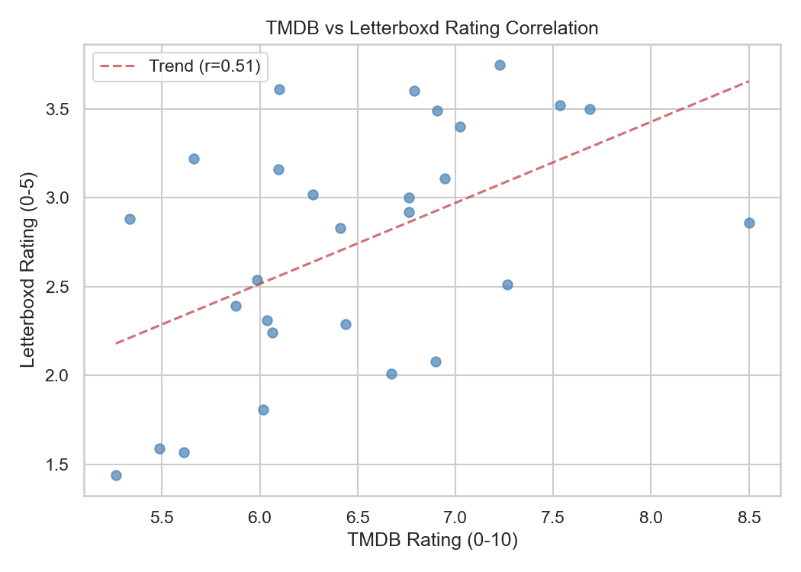
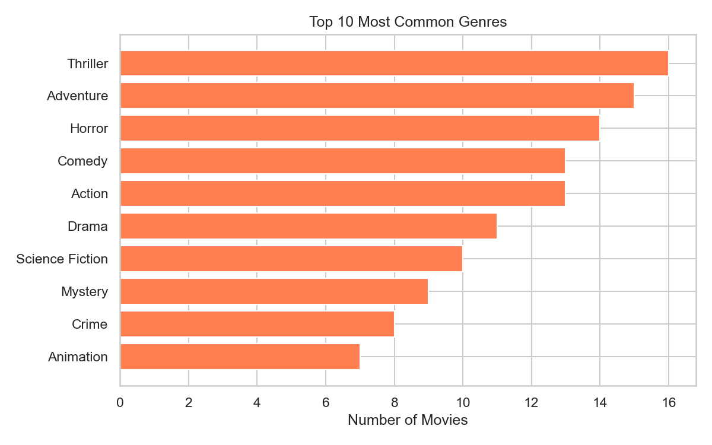
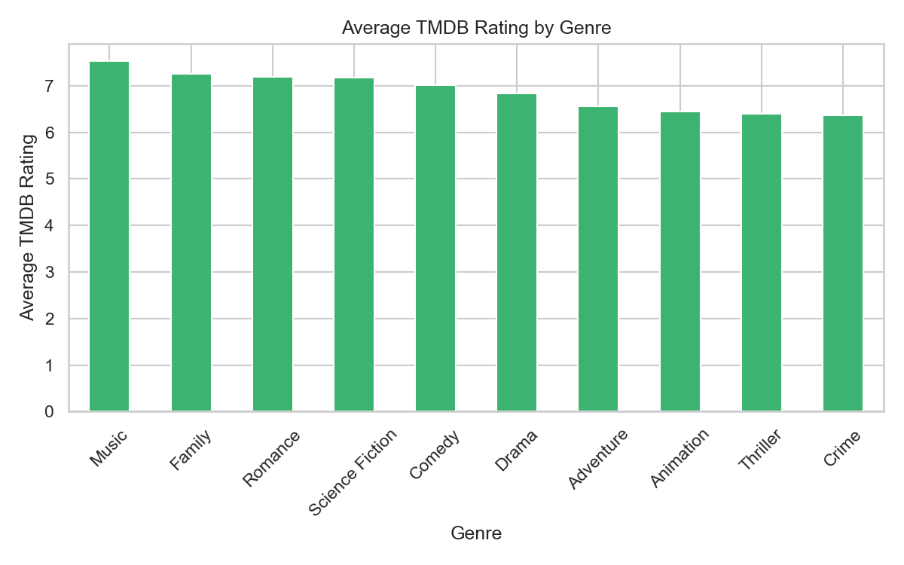
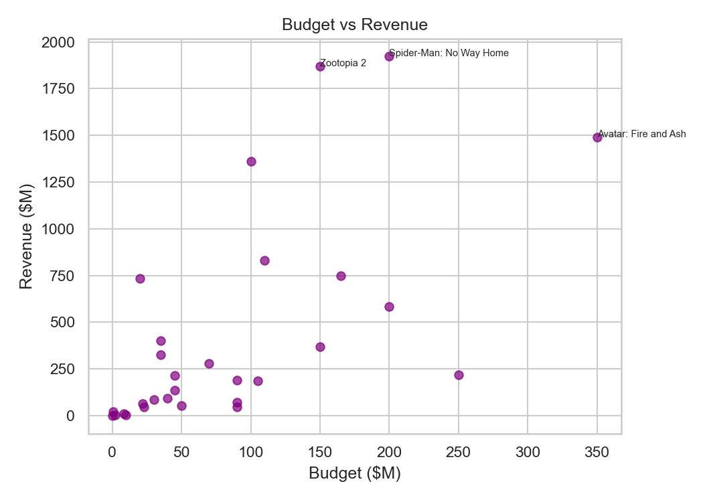

# Report: Movie Data Collection & Analysis

UCLA STAT418 — Yutong Ma (ytm02)

## Data Collection Summary

| Source | Records Collected | Method |
|--------|------------------|--------|
| TMDB API | 50 movies | REST API with API key |
| Letterboxd | 37/50 successfully scraped | BeautifulSoup HTML parsing |

- 13 movies had no Letterboxd page (mostly unreleased 2026 titles)
- Budget available for 33/50 movies; revenue available for 32/50

---

## Analysis Findings

### 1. Rating Correlation (TMDB vs Letterboxd)

**Correlation coefficient: r = 0.511**

There is a moderate positive correlation between TMDB and Letterboxd ratings. Films that rate well on TMDB tend to rate well on Letterboxd, but the relationship isn't perfect. Letterboxd users (film enthusiasts) tend to diverge from general TMDB audiences on genre films.

---

### 2. Genre Distribution

The most common genre in the dataset is **Thriller (16 movies)**, followed by Adventure and Horror.

**Average TMDB Rating by Genre:**

The highest rated genre is **Music**, followed by Science Fiction and Adventure. Horror tends to score lower on average.

---

### 3. Financial Analysis

**Most profitable film: Spider-Man: No Way Home**

There is a positive relationship between budget and revenue, but several high-budget films underperformed. Blockbusters with large marketing budgets do not always guarantee returns.

---

## Summary Statistics

| Metric | Value |
|--------|-------|
| Total movies | 50 |
| Avg TMDB rating | 6.62 / 10 |
| Avg Letterboxd rating | 2.74 / 5 |
| Rating correlation | 0.511 |
| Top genre | Thriller |

---

## Challenges

- **Letterboxd matching**: Titles with special characters (e.g. `¿Quieres Ser Mi Novia?`) needed careful slug conversion
- **Missing budget data**: TMDB returns `0` for unknown budgets, requiring replacement with NaN
- **Unreleased films**: Many 2026 movies had no Letterboxd pages yet

## Limitations & Future Work

- Increase dataset to 200+ movies for more robust correlations
- Use Letterboxd's official API (if available) instead of scraping
- Analyze TV shows separately from movies
- Add time-series analysis as more 2026 releases accumulate
